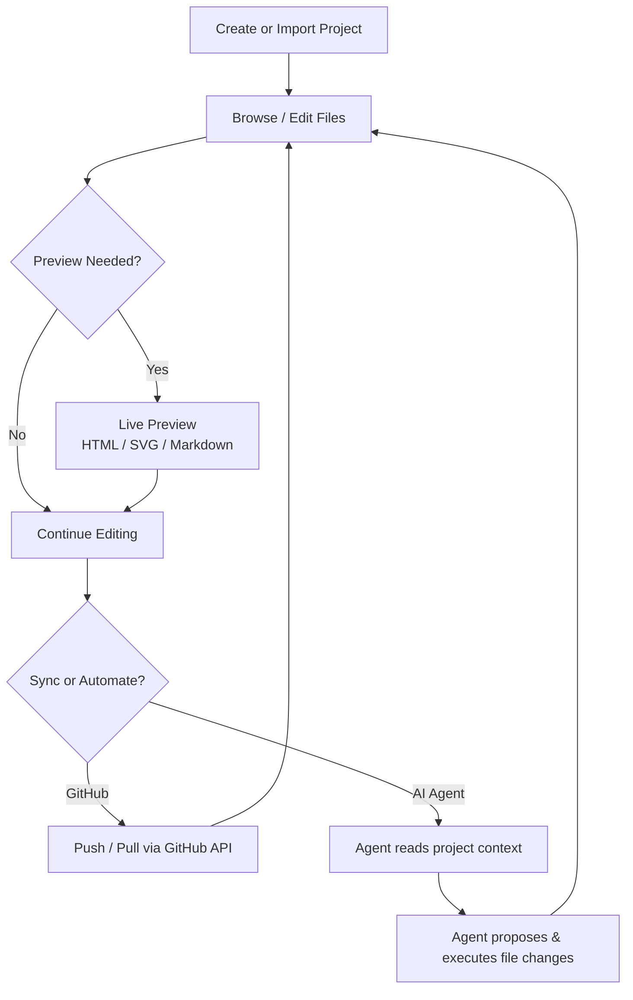
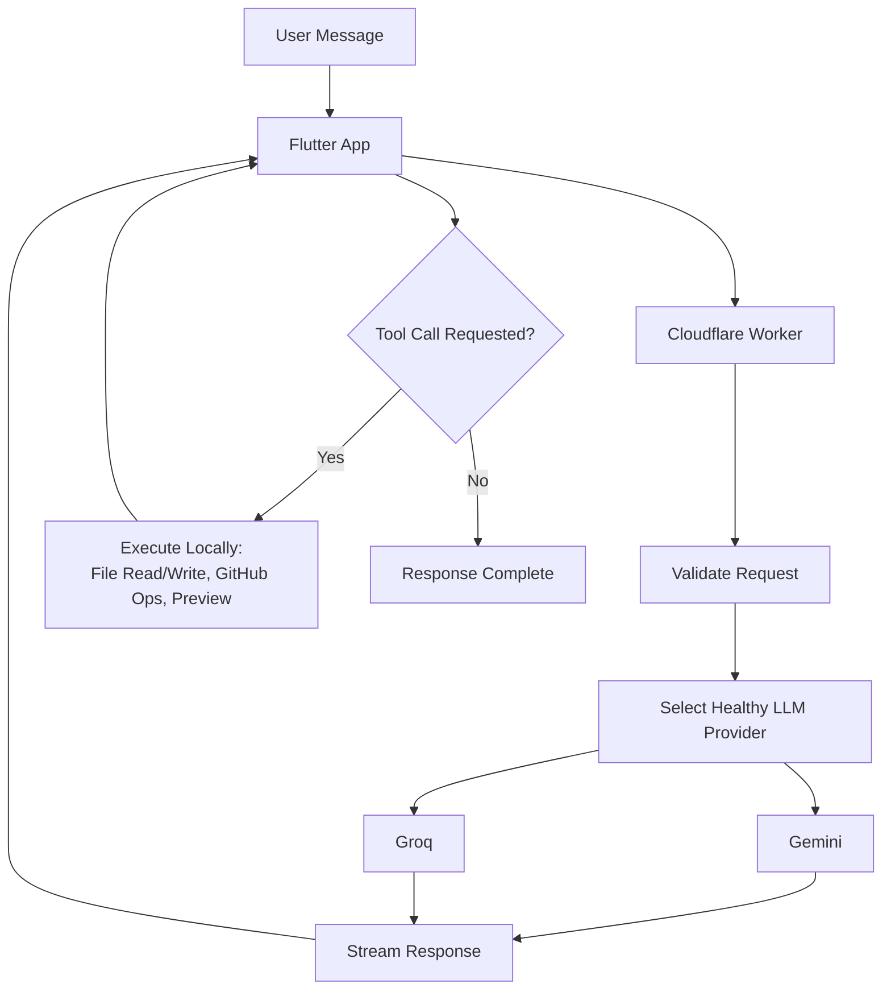

# Pro Coding Studio — Mobile Development Workspace

Pro Coding Studio is a mobile development workspace that lets developers create, edit, preview, and ship code projects directly from their phone — without needing a desktop editor, a separate file browser, or a separate Git client.

The idea is simple: consolidate the core parts of a desktop coding workflow — project management, a code editor, file browsing, live preview, and repository sync — into a single mobile app, and add an AI coding agent that can act directly on the project.

**Status:** Actively developed prototype / early MVP
**Platform:** Android (Flutter)
**Language:** Dart, JavaScript (backend)
**Backend:** Cloudflare Workers
**AI providers:** Gemini, Groq (with automatic fallback)
**Persistence:** SQLite (local) + Cloudflare KV (remote)

---

## The idea behind it

A typical mobile developer's workflow today is fragmented: an editor here, a file browser there, a separate Git client, a separate preview tool, and no AI assistance unless you're back at a desktop.

Pro Coding Studio consolidates that into one workspace:

- Create or import a project
- Browse and edit files with syntax highlighting
- Preview HTML, SVG, and Markdown directly in-app
- Sync the project with GitHub
- Hand the project to an AI agent that can read, write, and modify files on your behalf

Instead of context-switching between tools, the developer stays in one app for the entire loop: **create → edit → preview → sync → automate.**

---

## Core workflow

---

## The AI agent

The agent isn't a chatbot bolted onto the side of the app — it operates directly on the project.

A user's request is routed through a Cloudflare Worker backend, which authenticates the request, selects a healthy LLM provider (with automatic fallback between providers), and streams the response back to the app in real time. When the model decides it needs to act — reading a file, writing a file, or interacting with the connected GitHub repository — the app executes that action locally and reports the result back, and the conversation continues until the task is complete.

This gives the agent a genuine feedback loop rather than a single-shot response: it can inspect a file, make a change, verify the result, and continue — similar in spirit to how the app's own editor tracks state, just driven by the model instead of the user.

---

## Feature set

**Project management**
Create, import, duplicate, rename, delete, and search local projects. Full ZIP import/export. Remote template loading, so new projects can start from a pre-built starting point instead of a blank folder.

**Editor**
Multi-tab, project-scoped editing with dirty-state tracking, undo history, and syntax highlighting across common file types.

**Live preview**
In-app rendering for HTML, SVG, and Markdown — no need to leave the app to see the result of a change.

**File system**
Full hierarchical file explorer: create, rename, move, copy, delete, recursive search, and background-indexed directory scanning so large projects stay responsive.

**GitHub integration**
OAuth-based GitHub login, repository listing/creation/deletion, and full push/pull sync built on the underlying Git data primitives (blobs, trees, commits, branch references) rather than a simplified wrapper — giving more control over exactly what gets committed.

**AI coding agent**
Chat-driven agent with persistent sessions, project-aware context, and the ability to read/write files and interact with the connected GitHub repository as part of completing a task.

**Media & monetization**
In-app image, video, and audio playback for project assets; ad-supported free tier with a local token-balance system.

---

## Example workflows

**Start a new project from a template**
A developer picks a template from the in-app catalog instead of starting from an empty folder. The template is fetched and unpacked directly into a new local project, ready to edit immediately.

**Edit and preview in one loop**
A developer edits `index.html` in the multi-tab editor, saves, and taps preview — the rendered page appears in-app without needing a browser or external tool.

**Sync to GitHub**
A developer connects a GitHub repository, and the app walks through the full commit sequence (blob → tree → commit → branch update) to push the current project state.

**Delegate a task to the agent**
A developer asks the agent to make a specific change. The agent inspects the relevant files, makes the edit, and reports back — the developer reviews the diff rather than making the change by hand.

---

## Technology stack

| Area | Technology |
|---|---|
| Mobile framework | Flutter (Dart) |
| State management | Riverpod |
| Routing | GoRouter |
| Local persistence | SQLite |
| Secure credential storage | Flutter Secure Storage |
| Backend | Cloudflare Workers (JavaScript) |
| Remote persistence | Cloudflare KV |
| AI providers | Gemini, Groq (automatic health-based fallback) |
| Version control integration | GitHub REST + Git Data API |
| Monetization | Google Mobile Ads |
| CI | GitHub Actions (automated release builds) |

---

## Architecture

The app follows a **feature-first structure** — each major capability (dashboard, editor, file system, GitHub, agent, templates, settings) is organized as its own self-contained module rather than being split across generic technical layers. This keeps related code together and makes individual features easier to reason about and extend independently.

Key architectural decisions:

- **Riverpod for both state and dependency injection** — avoids a separate service-locator layer.
- **Git Data API over a simplified GitHub wrapper** — commits are built explicitly (blob → tree → commit → ref update), giving precise control over what gets pushed.
- **Provider health tracking on the backend** — the AI layer isn't tied to a single LLM provider; it tracks provider health and automatically falls back to a secondary provider if the primary is degraded or rate-limited.
- **Background processing for anything expensive** — file indexing and template parsing are pushed off the UI thread so large projects don't cause jank.
- **Project-scoped editor state** — open tabs are explicitly scoped per project, so switching projects never bleeds state between them.

---

## Current status

Pro Coding Studio is an actively developed prototype with a substantial amount of working functionality across local project management, editing, GitHub sync, AI assistance, templates, and previews. It builds successfully via CI and produces a working Android release artifact.

It is not yet a fully production-hardened application. Like most fast-moving prototypes, it currently has gaps in automated test coverage (particularly around backend and integration paths), and the security posture — authentication hardening, secret management, and abuse protection — needs a dedicated pass before wider release. That work is the next priority ahead of broader distribution.

---

## Where I want to take it

**Harden security** — Move to a production-grade credential handling and transport model before any public release, with proper rate limiting, input validation, and secret management practices throughout.

**Expand test coverage** — Particularly around the backend/API layer, GitHub sync, and the agent's tool-execution loop.

**Extension system** — Early groundwork exists for a broader extension/plugin model; the goal is to let the app's capabilities grow without every feature being built directly into the core.

**Offline-first templates** — Reduce dependency on a remote template source with local caching and version pinning.

**Observability** — Add production-grade error monitoring so issues in the field are visible rather than silent.

---

## How I built it

I designed the overall architecture, feature structure, and technical direction — including the feature-first module layout, the Riverpod-based state model, the Git Data API integration approach, and the provider-fallback design for the AI backend.

AI coding agents were used extensively during implementation. The system-level design decisions — architecture, workflow, feature scope, integration points, and testing strategy — remained my responsibility throughout. This project, like others in my portfolio, is also an exploration of AI-assisted software engineering: using coding agents as implementation tools while keeping architectural judgment human-directed.

---

## Final thought

Most mobile "coding" apps stop at being an editor. The interesting problem here was different: can a mobile app own the *entire* loop — project, edit, preview, sync, and now delegate — without forcing the developer back to a desktop for anything but the heaviest lifting.

Pro Coding Studio is my current answer to that question.
