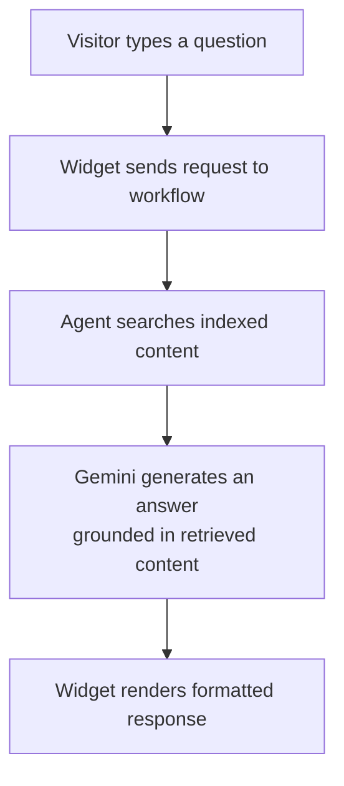
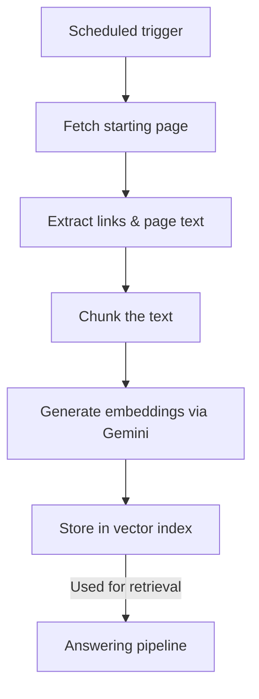

# Radha — Embeddable AI Documentation Assistant

Radha is a lightweight, embeddable chat widget that lets website visitors ask natural-language questions and get answers grounded in that website's own content — instead of relying on generic LLM knowledge that may be outdated or unrelated to the site.

A site owner drops in a single `<script>` tag. Radha handles the rest: crawling and indexing the site's content, answering visitor questions through retrieval-augmented generation, and rendering formatted responses directly in the page.

**Status:** Live — currently deployed on [Pro Coding Studio's documentation site](https://prajwalsinghkalwad.github.io/Pro-Coding-Studio-Documentation)
**Frontend:** Vanilla JavaScript (single-file embed, no framework, no build step)
**Orchestration:** n8n workflow automation
**LLM:** Google Gemini (chat + embeddings)
**Retrieval:** In-memory vector store
**Hosting:** GitHub Pages (widget) + n8n Cloud (workflow)

---

## The idea behind Radha

Most "add AI chat to your site" solutions either answer from general model knowledge — which drifts from what your site actually says — or require standing up a full backend just to ground responses in your own content.

Radha is built to be the lightweight version of that: a single script embed on the frontend, and a workflow-based backend (rather than a custom server) that crawls the site, indexes it, and answers strictly from what it finds there.

The name comes from wanting something that feels less like a generic support bot bolted onto a page, and more like a guide that actually knows the site it's living on.

---

## How it works

### Answering a question

### Keeping the index up to date

The two pipelines are decoupled: indexing runs on a schedule in the background, while answering happens in real time against whatever's currently indexed.

---

## What's under the hood

The frontend is intentionally minimal: a single, dependency-free JavaScript file that any site can embed via `data-*` attributes on the script tag — no package manager, no build pipeline, no framework lock-in. It handles the chat UI, retries and timeouts on failed requests, an offline state, and rendering of formatted (Markdown-style) responses including headings, code blocks, and links.

The backend runs entirely as an **n8n workflow** rather than a custom server. That means the RAG pipeline — webhook intake, vector search, LLM generation, response formatting — and the content-indexing pipeline — crawling, text extraction, chunking, embedding — are both built as visual, node-based automations instead of hand-written backend code. Google Gemini handles both the chat generation and the embeddings used for retrieval.

A scheduled GitHub Actions job keeps the backend warm so the first real request of the day doesn't hit a cold start.

---

## Features

**Embeddable widget**
Single-script install, configurable name, color, icon, position, and welcome message — all through `data-*` attributes, no code changes needed per site.

**Grounded answers**
Responses are generated from content actually indexed from the site, not from the model's general knowledge alone.

**Resilient by default**
Automatic retries with backoff on failed requests, a request timeout so the UI never hangs indefinitely, and a visible offline state when connectivity drops.

**Formatted responses**
Headings, bold/italic text, code blocks, lists, blockquotes, and links render properly in the chat panel rather than as raw text.

**Scheduled content indexing**
The site is periodically re-crawled and re-indexed so answers stay current with the underlying documentation, without manual re-indexing.

**Design goals still in progress**
Multi-site tenant isolation, per-visitor authenticated sessions, and full recursive site crawling are part of the intended design and are actively being built out — the current deployment runs a single-tenant setup against one indexed site.

---

## Example: a real interaction

A visitor on the docs site opens the widget and asks a question about a specific feature. Radha searches the indexed documentation, finds the relevant section, and has Gemini compose an answer constrained to that retrieved content — rather than guessing from general training data. If the request fails or the connection drops, the widget retries automatically before surfacing an error, rather than leaving the visitor with a silently stuck chat.

---

## Technology stack

| Area | Technology |
|---|---|
| Widget | Vanilla JavaScript, no framework or build step |
| Backend orchestration | n8n (workflow automation) |
| LLM | Google Gemini |
| Embeddings | Google Gemini |
| Retrieval | In-memory vector store |
| Text processing | Recursive chunking with overlap |
| Frontend hosting | GitHub Pages |
| Backend hosting | n8n Cloud |
| Keep-alive | GitHub Actions (scheduled) |

---

## Current status

Radha is live and actively answering questions on a real documentation site today. The core loop — embed, ask, retrieve, answer — works end to end in production.

It's still an early-stage deployment rather than a hardened multi-tenant product: today it serves a single site with a single shared conversation context, and the security/authentication layer needed to safely support multiple independent sites is still being built out. That hardening work — proper request validation, rate limiting, and per-site/per-visitor isolation — is the immediate next priority before Radha is offered more broadly.

---

## Where I want to take Radha

**Real authentication & per-site isolation** — Move from a single shared setup to properly isolated, validated access per embedding site.

**Rate limiting & abuse protection** — Protect the backend from unbounded request volume now that it's live.

**Durable storage** — Move from an in-memory vector store to a persistent, restart-safe database (e.g., Postgres + pgvector), so the index survives backend restarts.

**Full recursive crawling** — Expand indexing to cover an entire site's content rather than a single seed page and its immediate links.

**Per-visitor memory** — Give logged-in visitors continuity across sessions instead of one shared conversation context.

**Uptime monitoring** — Add real observability instead of relying on a keep-alive ping alone.

---

## Design principles

- **Answer from the site, not just the model** — Ground responses in retrieved content rather than general LLM knowledge.
- **Zero-friction install** — A site owner should be able to add Radha with one script tag and no build step.
- **Keep the backend visual and inspectable** — Workflow-based orchestration over hand-rolled server code, so the pipeline stays easy to reason about and modify.
- **Fail visibly, not silently** — Retries and offline states instead of a chat that just stops responding.

---

## How I built it

I designed the widget's embedding model, the RAG pipeline structure, and the indexing workflow — including the decision to build the backend as an orchestrated n8n workflow rather than a custom server, and the retry/timeout/offline handling on the frontend.

AI coding agents were used during implementation. The architecture, integration choices, and what to prioritize (or defer) remained my call throughout — this project, like the others in my portfolio, pairs AI-assisted implementation with human-directed engineering decisions.

---

## Final thought

The interesting constraint with Radha wasn't "can an LLM answer questions about a website" — that part's easy. It was doing it with the smallest possible footprint: no framework, no custom backend, no build pipeline, just a script tag and a workflow. Radha is what that constraint produced, and it's currently answering real questions on a real site.
