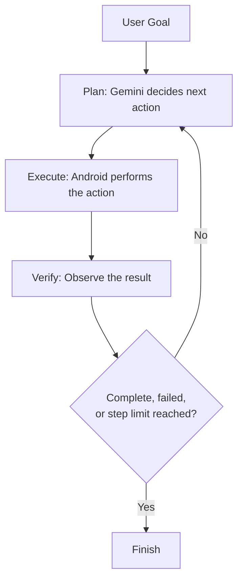
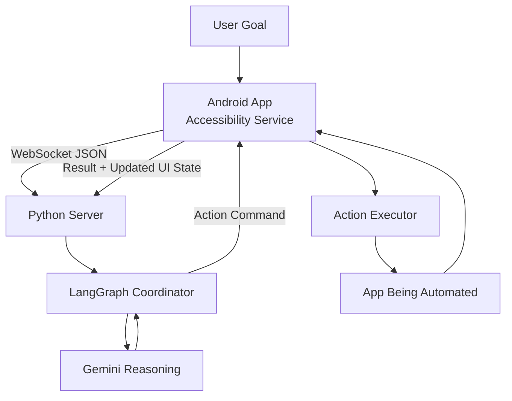

# Surya — Intelligent UI Automation System

Surya is an intelligent UI automation system that lets users interact with mobile applications using natural language.

Instead of manually navigating through an application or defining every automation step beforehand, a user describes what they want to accomplish. Surya observes the current interface, reasons about what to do next through an LLM, executes an action, and checks the result before continuing.

The current prototype targets Android, with the client/server split designed so the reasoning layer isn't tied to any one platform.

**Status:** Working prototype — core loop implemented; end-to-end task reliability is still being validated across real apps
**Platform:** Android
**LLM:** Google Gemini
**Client:** Kotlin (Android Accessibility Service)
**Server:** Python (async WebSocket)
**Agent orchestration:** LangGraph (plan → execute → verify loop)
**Persistence:** SQLite (agent checkpoint/recovery state)
**Application link:** [Download](https://github.com/PRAJWALSINGHKALWAD/prajwalsinghkalwad.github.io/releases/download/v1/surya.apk)

---

## The idea behind Surya

The idea started with a simple question:

> What if you could tell an application what you want, instead of telling it exactly how to do it?

Traditional automation depends on predefined workflows — a fixed sequence like `Open → Click → Type → Scroll → Click`. This works when the interface and workflow are predictable, but real applications aren't always like that: screens change, elements move, and the right next step often isn't knowable until the previous one finishes.

Surya takes a different approach. Rather than defining the entire workflow upfront, the agent observes the current state, decides the next action, performs it, and observes the new state — so the workflow is built dynamically during execution rather than scripted in advance.

### Agent loop

The loop is intentionally bounded — it runs for a fixed maximum number of steps rather than indefinitely, so a task that can't converge stops instead of looping forever.

---

## Understanding the interface

Surya primarily uses the Android accessibility tree to understand the current UI. The raw accessibility data can contain a lot of information, much of which isn't useful for the agent, so it's parsed into a flattened, focused representation before reaching the reasoning layer — things like element type, visible text, and whether an element is clickable, editable, or scrollable.

This gives the reasoning layer a cleaner picture of the interface than raw accessibility data would.

### Why process the accessibility tree?

The goal isn't simply to give the LLM more information — it's to give it *useful* information in a form that's easier to reason about. Processing the tree helps:

- Remove irrelevant UI information
- Reduce unnecessary context
- Make the interface easier to interpret
- Provide a consistent representation for reasoning
- Separate UI-specific detail from the agent's decision-making

### When accessibility information isn't enough

Accessibility data doesn't describe every visual interface completely — games, canvas-based UIs, and other visually complex screens can contain information the accessibility tree doesn't capture well. Surya can capture a screenshot for these situations. Feeding that captured screenshot directly into the model's visual reasoning is an active area of work rather than a fully wired capability today.

> Use structured information when it's enough. Use visual information when it's needed.

---

## The agent

Surya uses a thin-client / server-brain split: the Android app handles observation and action execution, while the Python server handles orchestration and LLM reasoning. This keeps the reasoning logic independent of any single device or platform.

The agent doesn't assume an action succeeded — after executing a step, it re-observes the interface and uses that new state as the basis for its next decision. This feedback loop is what lets Surya adapt mid-task rather than blindly following a fixed script.

### Completing a task

A single request can involve many individual interactions. For example:

> "Open the browser, search for Python documentation, find the PDF, and download it."

Surya may need to navigate to the browser, find the search interface, enter the query, inspect results, identify the right document, open it, start the download, and confirm the outcome — without the user specifying each of those steps in advance.

### When Surya gets stuck

An autonomous system shouldn't keep acting indefinitely when it's uncertain. Surya stops and surfaces the situation when it hits its step limit, encounters a failure, or reaches a state it can't confidently act on — rather than continuing to act on a guess.

### Human-in-the-loop interaction

Surya can involve the user directly when it needs more context. The current mechanism is a structured choice: the agent presents a short prompt with a small set of options as an on-screen overlay (for example, confirming an action before proceeding), and the user's tap is sent back as the answer.

Open-ended, free-text clarification — the agent asking a genuinely open question and parsing a typed or spoken answer — is on the roadmap but not yet how the current build handles it.

Surya can speak responses back to the user through the device's built-in text-to-speech, with an optional higher-quality voice provider when configured.

---

## What Surya can do today

The current prototype supports a working set of UI interactions:

- Tapping (by coordinate, resource ID, visible text, or content description)
- Text input
- Long press
- Swiping
- Back / home / recent-apps navigation
- Launching other applications by package name
- Opening URLs
- Overlay-based confirmations and choices
- On-device screenshot capture
- Spoken responses (system TTS, optional higher-quality voice)

These combine dynamically based on the task and the current UI state — Surya isn't limited to firing off isolated actions in sequence; it chains them toward the user's stated goal.

### Example tasks

**App navigation** — "Open the app and go to settings."
**Search** — "Find the item I was looking for."
**Multi-step actions** — "Open the app, change this setting, and confirm it applied."

---

## Architecture

The Android app stays deliberately thin: it captures the accessibility tree, executes declarative commands (`click`, `swipe`, `open_app`, etc.), and reports results — it doesn't make decisions itself. All reasoning happens server-side, communicated over a WebSocket connection as JSON messages.

### Technology stack

| Area | Technology |
|---|---|
| Client platform | Android (Kotlin, Jetpack Compose) |
| LLM | Google Gemini |
| Agent orchestration | LangGraph (plan → execute → verify state machine) |
| Backend transport | Python, async WebSocket server |
| Persistence | SQLite (LangGraph checkpoint state) |
| UI understanding | Android Accessibility Tree |
| Visual capture | On-device screenshot (optional) |
| Voice output | Android system TTS, optional higher-quality provider |
| User interaction | Android control panel + on-screen overlay prompts |

### Task persistence

The current persistence layer stores LangGraph checkpoint state per device — this lets an in-progress agent task recover its place if interrupted, but it isn't yet a general memory system. It doesn't currently retain user preferences or recurring behavior across sessions; that's a planned direction rather than a current capability.

---

## Where the project is today

Surya is a working prototype. The core loop — natural-language goal → UI understanding → reasoning → action → feedback → next action — is implemented and runs end to end on a device.

What's proven:

- Accessibility-tree capture and parsing
- The full plan/execute/verify agent loop against a live device
- The declarative action set (tap, swipe, text entry, navigation, app launching)
- Overlay-based confirmations
- Screenshot capture
- Spoken output

What's still being hardened rather than fully proven:

- Reliable end-to-end task completion across a wide range of real apps
- Automated test coverage for the agent loop itself
- A genuine memory layer beyond crash-recovery checkpoints

The current goal is to validate and harden this architecture, not to present Surya as a finished, production-ready platform.

### Current limitations

**Security** — The prototype doesn't yet have the authentication, encryption, and action-safety controls a production release would need. Hardening this is a priority before any wider testing.

**Speed** — Because the system repeatedly observes the UI and reasons about the next step, execution is slower than deterministic, pre-scripted automation. Reducing this latency is ongoing work.

**Reliability** — LLM-based reasoning introduces uncertainty, and end-to-end task success hasn't yet been validated across a broad set of real apps. The design intentionally prioritizes stopping over continuing on a low-confidence guess.

**Platform support** — Currently Android only. The client/server split was chosen specifically so this isn't a structural blocker to expanding later.

---

## Where I want to take Surya

**Validate reliability** — Get real end-to-end task success data across a meaningful range of apps, not just isolated actions.

**Cross-platform execution** — Extend the same thin-client model beyond Android.

**Real memory** — Move beyond crash-recovery checkpoints to genuine long-term memory about a user's preferences and recurring behavior.

**Open clarification** — Move from structured overlay choices to genuine free-text/spoken clarification questions.

**Formal safety policy** — Introduce an explicit approval/confirmation policy for higher-risk actions, rather than relying on the overlay mechanism alone.

**Automated testing** — Build real coverage for the agent loop, action execution, and protocol handling — not just template tests.

**Secure execution** — Add proper authentication, encryption, and device isolation before expanding beyond a local/trusted setting.

**Multiple agents** — Explore specialized agents for planning, UI understanding, execution, and verification instead of one general-purpose loop.

---

## Design principles

- **Observe before acting** — Understand the current state before deciding what to do.
- **Adapt instead of replay** — Respond to the current UI rather than blindly replaying a fixed sequence.
- **Give the model useful information** — Structured, relevant UI information beats raw data volume.
- **Use vision when necessary** — Not every interface is fully describable through accessibility data alone.
- **Bound execution** — Cap how long the agent can run on a single task so uncertainty doesn't turn into runaway behavior.
- **Ask rather than guess** — When the agent needs information from the user, it should ask, even if the current mechanism for asking is still basic.
- **Fail gracefully** — Stopping is better than continuing with low confidence.

---

## How I built it

I designed the overall architecture, interaction model, agent workflow, and technical direction of Surya — the thin-client/server split, the accessibility-tree processing pipeline, the LangGraph plan/execute/verify loop, and the declarative action protocol between client and server.

AI coding agents were used extensively during implementation. The system-level design decisions — architecture, workflow, feature direction, integration, and overall development process — remained my responsibility throughout. This project has also been an exploration of AI-assisted software engineering: using coding agents as implementation tools while keeping architectural and engineering judgment human-directed.

---

## Project status

Surya is a working prototype with a functioning core loop on real Android devices. The next stage is turning that prototype into something **reliable, tested, secure, and cross-platform** — in that order of priority.

---

## Final thought

The interesting part of Surya isn't simply getting an LLM to click buttons. The bigger question I'm exploring is:

> Can an AI agent understand what a user wants and figure out how to accomplish it inside an interface without being given every step in advance?

Surya is my current attempt at answering that question — and an honest look at where that attempt currently stands.
